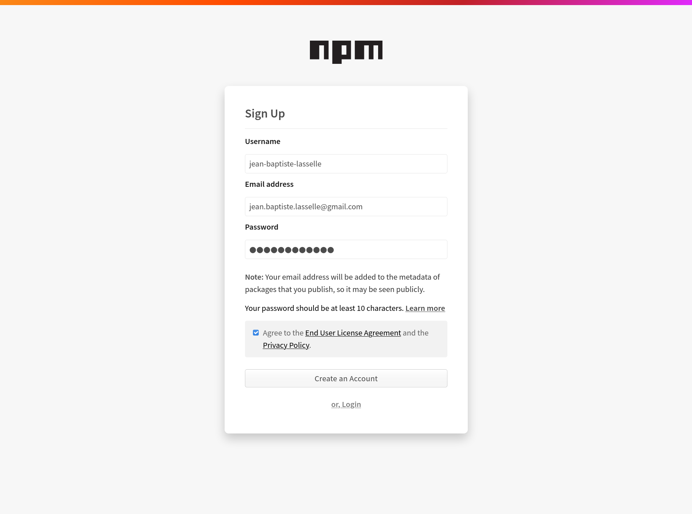

# How I publish the `generator-orbinoid` npm package

## https://npmjs.com setup for package publications

* signup :




* createthe `gravitee-lab` organization :


* I skipped inviting other https://npmjs.com users into the `gravitee-lab` organization :


## Then to publish my `npm` package

Publishing npm packages requires authentication

* First, let's have a natural look at `--help` :

```bash
$ npm login --help
npm adduser [--registry=url] [--scope=@orgname] [--auth-type=legacy] [--always-auth]

aliases: login, add-user

```
  * Alright, just from that, I can guess :
    * that `npm` allows several authentication methods. `--auth-type` valid values are `legacy`, `sso`, `saml`, `oauth`.
    * that `npm login` command saves authentication credentials to a local file, `${HOME}/.npmrc`, so we don't have to enter credentials everytime we login. unless we use the `--always-auth` gnu option.


## Npm Secrets management

* To run `npm publish`, you need to authenticate to the https://registry.npmjs.org registry :
  * authentication will happen non-interactively during the execution of the `npm publish` command,
  * this authentication will find authentication required informations, including the secret, in a file on your filesystem, a text file of path `~/.npmrc`
  * everytime you will run the `npm publish` command, you will need that file,
  * so you will generate it interactively once and for all, and store i on secrethub as a secret file.
  * after that, everytime you will need to run `npm publish`, you will first retrieve this secret file from secrethub, and run `npm publish`
  * Right after execution of `npm login` completed successfully, the content of the generated `~/.npmrc` file is one line :

```
//registry.npmjs.org/:_authToken=<LONG VALUE OF YOUR TOKEN>
```

* So first, to generate the `~/.npmrc` file, I ran the interactive command `npm login`. It has asked me for my username, my user password, and my user email. Those exact same username, password, and user email I used to signup to https://www.npmjs.com/
* Right after that, in the same shell session, I ran the following, non-interactive script to store my secret file `.npmrc` :

```bash
export ORG_NAME="gravitee-lab"
export REPO_NAME="orbinoid"

secrethub repo init "${ORG_NAME}/${REPO_NAME}"

secrethub mkdir --parents "${ORG_NAME}/${REPO_NAME}/npm/registry.npmjs.org/auth/users/owner"

export NPM_USER_NAME="jean-baptiste-lasselle"
export NPM_USER_EMAIL="jean.baptiste.lasselle@gmail.com"
export NPM_USER_PWD="jibl@t@dj1kk"
export NPM_USER_SECRETFILE_PATH="${HOME}/.npmrc"

# Store the [~/.npmrc] file to secrethub
secrethub write --in-file ${NPM_USER_SECRETFILE_PATH} "${ORG_NAME}/${REPO_NAME}/npm/registry.npmjs.org/auth/users/owner/dot-npmrc"
# Just storing other user infos, even though not as "highly" secret, kept as secret...
echo "${NPM_USER_NAME}" | secrethub write "${ORG_NAME}/${REPO_NAME}/npm/registry.npmjs.org/auth/users/owner/user_name"
echo "${NPM_USER_EMAIL}" | secrethub write "${ORG_NAME}/${REPO_NAME}/npm/registry.npmjs.org/auth/users/owner/user_email"
# another secret, kept "just in case", usedonly to login with [registry.npmjs.org] webui
echo "${NPM_USER_PWD}" | secrethub write "${ORG_NAME}/${REPO_NAME}/npm/registry.npmjs.org/auth/users/owner/user_pwd"

```

Finally, another option would have been to store the `npm` authentication secret, a token, as a string, to secrethb, and everytimeI need to `npm publish`, re-generate the `~/.npmrc` file like this :

```bash

# On one machine where I ran npm login to generate the [~/.npmrc] file
export NPM_USER_AUTH_TOKEN=$(cat ~/.npmrc | grep '_authToken' | grep '.org' | awk -F '_authToken' '{print $2}' | awk -F '=' '{print $2}')
echo "${NPM_USER_AUTH_TOKEN}" | secrethub write "${ORG_NAME}/${REPO_NAME}/npm/registry.npmjs.org/auth/users/owner/authtoken"
# Right after saving the secret [authToken], we immediately delete the [~/.npmrc] file
rm ~/.npmrc
# On any machine the token value would be retrieved from secrethub
export ORG_NAME="gravitee-lab"
export REPO_NAME="orbinoid"
export NPM_USER_AUTH_TOKEN=$(secrethub read ${NPM_USER_SECRETFILE_PATH} "${ORG_NAME}/${REPO_NAME}/npm/registry.npmjs.org/auth/users/owner/dot-npmrc")
echo "npm set //${NPM_REGISTRY_SHORT}/:_authToken ${NPM_USER_AUTH_TOKEN}" > ~/.npmrc
npm token list
npm publish --access public
# as soon aswedo not need it any more, we deletethe secret files
rm ~/.npmrc
```

* How to revoke and delete an `npm` token :

```bash
# --
#
npm token list
# token ID is not the token value. Token ID is displayed by [npm token list], in the "id" Column
export TOKEN_ID=e339e9

export TOKEN_VALUE=e339e9c5-a716-4492-a2f2-1a429560ad7e
npm token revoke ${TOKEN_ID}
npm token delete ${TOKEN_VALUE}

```

* example std out :

```bash
$ cat ~/.npmrc
//registry.npmjs.org/:_authToken=e339e9c5-a716-4492-a2f2-1a429560ad7e
$ npm token --help
npm token list
npm token revoke <tokenKey>
npm token create [--read-only] [--cidr=list]
$ npm token list
┌────────┬─────────┬────────────┬──────────┬────────────────┐
│ id     │ token   │ created    │ readonly │ CIDR whitelist │
├────────┼─────────┼────────────┼──────────┼────────────────┤
│ b437df │ e339e9… │ 2020-10-15 │ no       │                │
└────────┴─────────┴────────────┴──────────┴────────────────┘
$ npm token revoke e339e9c5-a716-4492-a2f2-1a429560ad7e
Removed 1 token
$ cat ~/.npmrc
//registry.npmjs.org/:_authToken=e339e9c5-a716-4492-a2f2-1a429560ad7e
$ npm whoami
jean-baptiste-lasselle

```

* also interesting :

```bash
$ npm org ls gravitee-lab
┌────────────────────────┬───────┐
│ user                   │ role  │
├────────────────────────┼───────┤
│ jean-baptiste-lasselle │ owner │
└────────────────────────┴───────┘
$ npm whoami
jean-baptiste-lasselle

```

## NPM registry package management rules

* By default, `npm` does not allow publishing again, a package version already published (registry immutability by default). If you try to anyway, here is the `npm` error you will get :

```bash
npm ERR! 403 403 Forbidden - PUT https://registry.npmjs.org/@gravitee-lab%2fgenerator-orbinoid - You cannot publish over the previously published versions: 0.0.1-alpha.
```

* This behavior :
  * ensures that people using packages from `npm` registry, they won't someday unexpectedly see their own software broken, because you changed the content of a specific version of your package. Npm Registry is safe to use for people. That's what it means.
  * encourages you to _test_ before publishing.


## References

* https://zellwk.com/blog/publish-to-npm/
